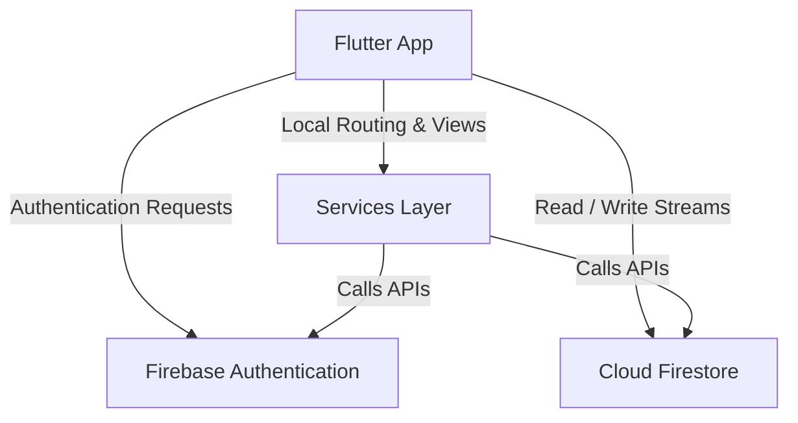

# Technical Documentation - ErasmusBuddy

This document provides a technical overview of the ErasmusBuddy mobile application, detailing its architecture, components, core libraries, and technical design decisions.

---

## 1. System Architecture

ErasmusBuddy is built as a cross-platform mobile application using the **Flutter** framework (Dart language) on the frontend, and **Firebase** as the backend service suite.

### 1.1 Frontend (Flutter / Dart)
- **UI Layer:** Implements standard Material Design widgets custom-styled for responsive and modern aesthetics.
- **Routing:** Uses static route name declarations (`static const routeName`) in screen components and centralizes route mapping in `lib/main.dart`.
- **State Management:** Employs built-in widgets such as `StreamBuilder` and `FutureBuilder` to reactively render changes in auth status and Firestore database collections in real-time.

### 1.2 Backend (Firebase)
- **Firebase Authentication:** Handles secure user registration, email/password validation, sign-ins, and session persistence.
- **Cloud Firestore:** A NoSQL cloud database storing shared travel ideas as documents under the `travelIdeas` collection.

---

## 2. Core Packages & Libraries

The following dependencies are used as defined in the `pubspec.yaml` manifest:

- **`firebase_core` (`^4.11.0`):** Initializes the connection between the Flutter application and the underlying Firebase project.
- **`firebase_auth` (`^6.5.4`):** Provides APIs for user register, login, logout, and state tracking.
- **`cloud_firestore` (`^6.6.0`):** Allows reactive queries, read, write, and collection/document stream listening.
- **`cupertino_icons` (`^1.0.8`):** Provides assets for iOS-style iconography, alongside default Material Icons.

---

## 3. Core Directory & Class Structure

- **`lib/main.dart`:** The root entry point. Configures Firebase initialization, sets the default home screen based on authentication status (`AuthService().authStateChanges`), and defines the screen routes table.
- **`lib/services/`:**
  - **[AuthService](file:///c:/Users/Umut/OneDrive/Masaüstü/bitirme/erasmusbuddy/lib/services/auth_service.dart):** Handles authentication actions (`login`, `register`, `logout`, and tracks `currentUser`/`authStateChanges`).
  - **[TravelIdeaService](file:///c:/Users/Umut/OneDrive/Masaüstü/bitirme/erasmusbuddy/lib/services/travel_idea_service.dart):** Manages Firestore operations (`createTravelIdea`, `getTravelIdeas` stream, `getTravelIdeaById`).
- **`lib/models/`:**
  - **[TravelIdea](file:///c:/Users/Umut/OneDrive/Masaüstü/bitirme/erasmusbuddy/lib/models/travel_idea.dart):** Data class modeling a travel plan idea (with `toMap` and `fromMap` converters).
- **`lib/screens/`:**
  - **[HomeScreen](file:///c:/Users/Umut/OneDrive/Masaüstü/bitirme/erasmusbuddy/lib/screens/home_screen.dart):** Welcomes the user, displays stats, and provides quick action navigation grid.
  - **[ProfileScreen](file:///c:/Users/Umut/OneDrive/Masaüstü/bitirme/erasmusbuddy/lib/screens/profile_screen.dart):** Shows active user profile details and statistics.
  - **[AddTravelPlanScreen](file:///c:/Users/Umut/OneDrive/Masaüstü/bitirme/erasmusbuddy/lib/screens/add_travel_plan_screen.dart):** Form screen to compose and share new travel plan ideas.
  - **[TravelPlanListScreen](file:///c:/Users/Umut/OneDrive/Masaüstü/bitirme/erasmusbuddy/lib/screens/travel_plan_list_screen.dart):** Lists all shared plans reactively using a custom search/filter mechanism.
  - **[TravelPlanDetailScreen](file:///c:/Users/Umut/OneDrive/Masaüstü/bitirme/erasmusbuddy/lib/screens/travel_plan_detail_screen.dart):** Renders detailed specifications of a single travel idea.

---

## 4. Key Technical Decisions

1. **Service Layer Abstraction:** Decoupling Firestore queries into independent classes like `TravelIdeaService` allows the UI code to remain clean and easier to maintain.
2. **Reactive Streams:** The application uses Firestore's real-time snapshots in combination with `StreamBuilder`. Any new travel ideas added by any student instantly refresh on other users' devices without refreshing the page.
3. **Robust Local Parsing:** DateTime conversions and Firestore null values are safely handled in the `TravelIdea.fromMap` model factory to avoid runtime rendering crashes.
